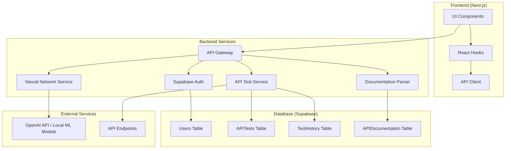
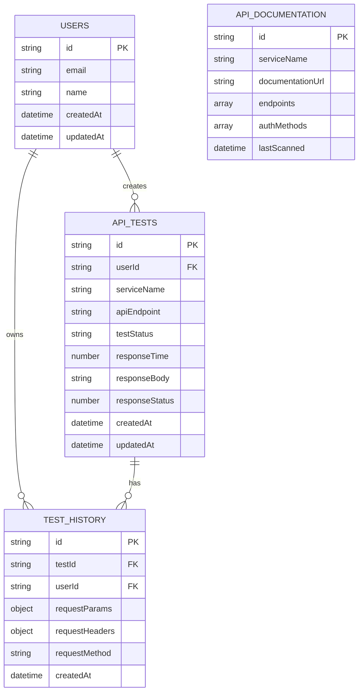
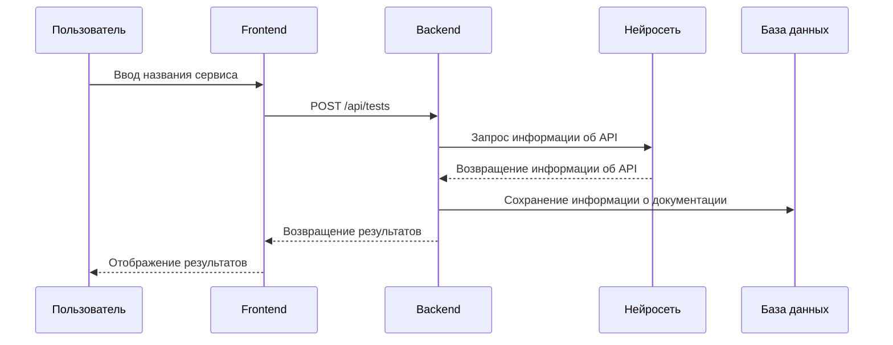
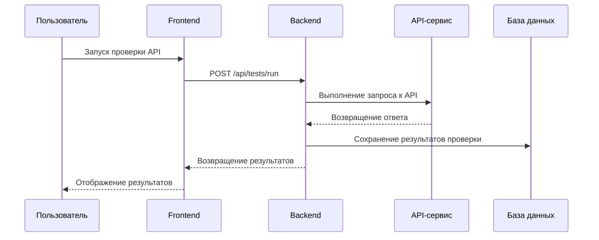

# Архитектурный план приложения APIfy

## 1. Обзор архитектуры

APIfy - это веб-приложение для проверки работоспособности API-сервисов, использующее нейросетевые технологии для автоматического поиска API и его документации по названию сервиса. Приложение построено по модульной архитектуре с использованием современных технологий.

### 1.1 Основные компоненты



## 2. Технический стек

### 2.1 Фронтенд
- **Next.js (TSX)**: Для создания современного веб-приложения с поддержкой TypeScript
- **Tailwind CSS**: Для стилизации и создания адаптивного дизайна
- **shadcn/ui**: Для готовых компонентов UI с хорошей доступностью

### 2.2 Бэкенд и аутентификация
- **Supabase**: Для аутентификации пользователей, хранения данных и API-сервера

### 2.3 Хостинг
- **Vercel**: Для хостинга Next.js приложения

### 2.4 Пакетный менеджер
- **pnpm**: Для управления зависимостями

### 2.5 Нейросетевые технологии
- Использование существующих API нейросетей (например, OpenAI GPT) или локальных моделей
- Для бесплатной реализации возможно использование open-source моделей

## 3. Архитектура базы данных

### 3.1 ERD диаграмма



### 3.2 Описание таблиц

#### 3.2.1 Пользователь (Users)
- id: string (уникальный идентификатор)
- email: string (email пользователя)
- name: string (имя пользователя)
- createdAt: datetime (дата создания аккаунта)
- updatedAt: datetime (дата последнего обновления)

#### 3.2.2 Проверка API (APITests)
- id: string (уникальный идентификатор)
- userId: string (ссылка на пользователя)
- serviceName: string (название сервиса)
- apiEndpoint: string (конечная точка API)
- testStatus: enum (успешно, неудачно, в процессе)
- responseTime: number (время отклика в миллисекундах)
- responseBody: string (тело ответа)
- responseStatus: number (HTTP статус ответа)
- createdAt: datetime (дата создания проверки)
- updatedAt: datetime (дата последнего обновления)

#### 3.2.3 История проверок (TestHistory)
- id: string (уникальный идентификатор)
- testId: string (ссылка на проверку API)
- userId: string (ссылка на пользователя)
- requestParams: object (параметры запроса)
- requestHeaders: object (заголовки запроса)
- requestMethod: string (HTTP метод)
- createdAt: datetime (дата создания записи)

#### 3.2.4 Документация API (APIDocumentation)
- id: string (уникальный идентификатор)
- serviceName: string (название сервиса)
- documentationUrl: string (URL документации)
- endpoints: array (список конечных точек)
- authMethods: array (методы аутентификации)
- lastScanned: datetime (дата последнего сканирования)

## 4. Архитектура фронтенда

### 4.1 Структура приложения

```
src/
├── components/          # Переиспользуемые компоненты
│   ├── ui/             # UI компоненты из shadcn
│   ├── forms/          # Формы приложения
│   └── cards/          # Карточки для отображения данных
├── pages/              # Страницы приложения
│   ├── index.tsx       # Главная страница
│   ├── dashboard/      # Панель управления
│   ├── tests/          # Страницы тестирования
│   └── profile/        # Профиль пользователя
├── lib/                # Утилиты и библиотеки
│   ├── supabase/       # Клиент Supabase
│   ├── types/          # Типы TypeScript
│   └── utils/          # Вспомогательные функции
├── hooks/              # Пользовательские хуки
├── services/           # Сервисы для работы с API
└── styles/             # Стили приложения
```

### 4.2 Страницы приложения

#### 4.2.1 Главная страница
- Поле для ввода названия сервиса
- Кнопка запуска поиска API
- Отображение результатов поиска

#### 4.2.2 Панель управления
- История проверок
- Статистика использования
- Настройки пользователя

#### 4.2.3 Страницы тестирования
- Интерфейс для проверки API
- Детали результатов проверки
- Возможность повторной проверки

#### 4.2.4 Профиль пользователя
- Настройки аккаунта
- История активности
- Предпочтения

## 5. Архитектура бэкенда

### 5.1 Службы приложения

#### 5.1.1 Служба аутентификации
- Регистрация и вход пользователей через Supabase
- Управление сессиями
- Защита защищенных маршрутов

#### 5.1.2 Служба тестирования API
- Выполнение проверок API
- Измерение времени отклика
- Сохранение результатов в базу данных
- Обработка различных методов аутентификации

#### 5.1.3 Служба парсинга документации
- Извлечение информации из документации API
- Поддержка форматов OpenAPI/Swagger
- Извлечение примеров запросов

#### 5.1.4 Служба нейросети
- Интеграция с API нейросети (OpenAI GPT)
- Или реализация локальных моделей
- Поиск API по названию сервиса

### 5.2 API маршруты

#### 5.2.1 Маршруты аутентификации
- POST /api/auth/signup - Регистрация пользователя
- POST /api/auth/login - Вход пользователя
- POST /api/auth/logout - Выход пользователя
- GET /api/auth/me - Получение информации о пользователе

#### 5.2.2 Маршруты API тестирования
- POST /api/tests - Создание новой проверки API
- GET /api/tests - Получение истории проверок
- GET /api/tests/[id] - Получение деталей конкретной проверки
- POST /api/tests/run - Выполнение проверки API

#### 5.2.3 Маршруты документации
- POST /api/docs/parse - Парсинг документации API
- GET /api/docs/[serviceName] - Получение документации для сервиса

## 6. Потоки данных

### 6.1 Поток поиска API


### 6.2 Поток проверки API


## 7. Безопасность

### 7.1 Аутентификация
- Регистрация и вход пользователей через Supabase
- Поддержка OAuth (Google, GitHub и др.)
- Защита паролей с использованием хэширования

### 7.2 Защита данных
- Шифрование конфиденциальных данных в базе данных
- Ограничение доступа к истории проверок только владельцу
- Защита от несанкционированного доступа к API ключам пользователей

### 7.3 Безопасность API
- Ограничение количества запросов (rate limiting)
- Проверка прав доступа к данным
- Защита от атак типа "отказ в обслуживании"

## 8. Этапы разработки

### 8.1 Этап 1: MVP (Минимально жизнеспособный продукт)
- Регистрация и аутентификация пользователей
- Ввод названия сервиса
- Простой поиск API (без нейросети)
- Ручное добавление URL API
- Базовая проверка доступности API
- Отображение результатов проверки

### 8.2 Этап 2: Интеграция с документацией
- Интеграция с OpenAPI/Swagger
- Автоматическое извлечение информации из документации
- Автоматическое формирование тестов на основе документации

### 8.3 Этап 3: Нейросетевые технологии
- Интеграция с API нейросети (если возможно в рамках бюджета)
- Или реализация простого поиска API через каталоги
- Улучшенный анализ документации с помощью ИИ

### 8.4 Этап 4: Расширенные функции
- История проверок
- Сравнение производительности
- Мониторинг доступности
- Тестирование аутентификации

### 8.5 Этап 5: Дополнительные возможности
- Экспорт отчетов
- Интеграции с внешними сервисами
- Расширенная аналитика

## 9. Потенциальные вызовы и решения

### 9.1 Проблемы с нейросетью
- **Вызов**: Сложности с интеграцией нейросети и поиск бесплатного решения
- **Решение**: 
  - Использование open-source моделей
  - Реализация поиска API через существующие каталоги
  - Парсинг документации с использованием NLP библиотек

### 9.2 Безопасность данных
- **Вызов**: Необходимость безопасного хранения данных пользователей
- **Решение**: 
  - Использование встроенных механизмов безопасности Supabase
  - Шифрование чувствительных данных
  - Регулярные аудиты безопасности

### 9.3 Масштабируемость
- **Вызов**: Ограничения бесплатных решений при росте пользователей
- **Решение**: 
  - Планирование архитектуры с учетом будущего масштабирования
  - Мониторинг производительности
 - Постепенный переход к платным решениям при необходимости